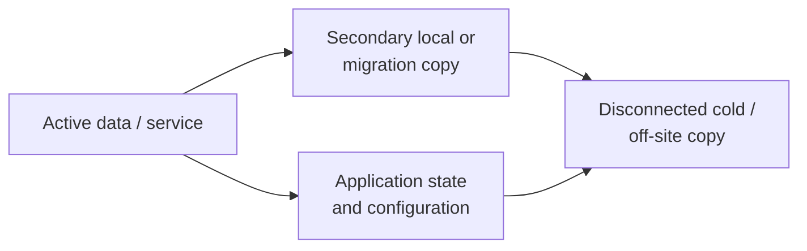

# Backup & Recovery Practices

Recoverability is designed into Systems Lab work by separating active data from recovery copies, protecting application state as well as files, preserving unstable sources before repair, and designing recovery paths that can be independently validated.

## Recovery model

The diagram summarizes confirmed copy relationships across projects. It does not claim a fully automated platform, universal coverage, or an established periodic restore-test program.

## Confirmed practices

| Context | Protection and recovery practice |
| --- | --- |
| Jellyfin media | Robocopy-supported migrations and periodic backup of the active media library |
| Jellyfin application state | Separate database/configuration backup so users, metadata, and service state are not conflated with media files |
| Cold/off-site storage | A 12 TB NAS-class disk used periodically for multiple backup purposes and disconnected between uses |
| Personal workstation | Secondary local working storage plus a separate cold/off-site backup practice for selected project and personal data |
| Storage incidents | Disk imaging or cloning before destructive repair when source condition and data value warrant it |
| Capacity upgrades | Data-preserving migration across 2 TB, 4 TB, and 8 TB media-server stages |
| Recovery cases | Restoration from a preserved image after source reinitialization |

The exact off-site storage location and data inventory are intentionally private.

## Backup design principles

### Protect the complete recovery object

A service may depend on more than large data files. Jellyfin recovery includes media plus database/configuration state; workstation recovery may require project files, settings, licenses, and a reproducible deployment path.

### Separate active failure domains

A second disk in the same computer supports working copies but shares power, malware, theft, user-error, and chassis risks. Disconnected and off-site copies address different failure modes.

### Preserve history where deletion propagation matters

Robocopy supports restartable copies, logging, and mirroring options. Mirror/purge behavior can propagate accidental source deletion, so each command must match the retention objective rather than treating synchronization and backup as synonyms.

### Design for testable restoration

A successful copy log proves a transfer, not a usable recovery. Historical image restores demonstrate the source-preserving recovery path; representative cold-copy restores and a non-destructive Jellyfin-state rehearsal remain improvements to formalize.

## Practical workflow

1. Define the files, service state, and recovery objective.
2. Map active, secondary, disconnected, and off-site copies.
3. Use a copy or imaging method that protects the source and preserves required data.
4. Review logs, errors, destination capacity, and representative files.
5. Disconnect cold media and revisit coverage when storage or project locations change.

## Incident recovery

When the source device itself is unstable, normal backup assumptions no longer apply. The priority becomes minimizing source writes and unnecessary reads, collecting health evidence, and acquiring an image or clone to healthy media. Filesystem repair follows preservation when possible. See [Storage Recovery & Cross-Platform Diagnostics](../projects/storage-recovery/README.md).

## Validation checklist

- Was the intended source copied to the intended destination?
- Did the job log report failed, mismatched, or skipped files?
- Is expected capacity available on the destination?
- Can representative documents, media, archives, and project files be opened?
- Is application state included and version-compatible?
- Is there a safe way to test restoration without overwriting the active system?
- Is the cold copy disconnected after completion?
- Does the off-site copy avoid the same physical incident as the active system?
- Are credentials, encryption recovery material, and product keys protected separately from public documentation?

## High-value improvements

- Establish a written cadence for the media library, Jellyfin state, and critical workstation data.
- Retain Robocopy logs and review nonzero exit codes according to Microsoft's documented bitmask behavior.
- Add checksum or sampled verification where data value justifies the additional time.
- Perform a non-destructive Jellyfin-state restore rehearsal.
- Perform periodic representative file restores from cold/off-site media.
- Label backup disks and jobs clearly enough to prevent source/destination reversal without exposing the off-site location.

## Scope boundaries

These are practical personal and household recovery controls. They are not presented as immutable storage, continuous replication, enterprise disaster recovery, or automated 3-2-1 compliance.

## Selected references

- [Microsoft: Robocopy](https://learn.microsoft.com/en-us/windows-server/administration/windows-commands/robocopy)
- [Jellyfin: Backup and Restore](https://jellyfin.org/docs/general/administration/backup-and-restore/)
- [GNU ddrescue manual](https://www.gnu.org/software/ddrescue/manual/ddrescue_manual.html)
