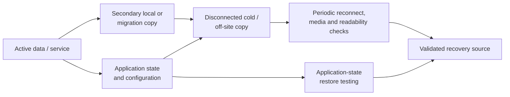

# Backup & Recovery Practices

Recoverability is part of system operation, not a task deferred until failure. Across the Systems Lab, that means separating active data from recovery copies, protecting application state as well as user files, preserving unstable sources before repair, reviewing copy evidence, checking representative files, and proving that recovery sources can produce usable restores.

## Recovery model

The diagram brings together practices used across projects, including periodic checks of cold/off-site media and successful restoration of application state. Automation and copy count are matched to each system's recovery requirements.

## Confirmed practices

| Context | Protection and recovery practice |
| --- | --- |
| Jellyfin media | Robocopy-supported migrations and periodic backup of the active media library, followed by result/log review and representative-file checks |
| Jellyfin application state | Separate database/configuration backups that have been created and successfully restored |
| Cold/off-site storage | A 12 TB NAS-class disk that is disconnected between uses, periodically reconnected and tested, and checked for stored-data readability/integrity |
| Personal workstation | Secondary local working storage plus a separate cold/off-site backup practice for selected project and personal data |
| Storage incidents | Disk imaging or cloning before destructive repair when source condition and data value warrant it |
| Capacity upgrades | Data-preserving migration across 2 TB, 4 TB, and 8 TB media-server stages |
| Recovery cases | Restoration from a preserved image after source reinitialization |

The exact off-site storage location and data inventory are intentionally private.

## Backup design principles

### Identify the complete recovery object

A usable service may depend on more than its large data files. Jellyfin recovery, for example, includes media plus database/configuration state. A Windows workstation may require user data, project files, application settings, license information, and a reproducible deployment path.

### Separate active failure domains

A second disk inside the same computer improves convenience and can support working copies, but it shares power, malware, theft, user-error, and chassis risks. A disconnected copy and an off-site copy address different failure modes.

### Preserve history where deletion propagation matters

Robocopy supports restartable copies, logging, and mirroring options. Destructive mirror/purge behavior requires care because an accidental source deletion can be repeated at the destination. Backup commands must match the retention objective instead of treating synchronization and backup as synonyms. After Robocopy operations, the result/summary or retained log is reviewed for completion and copy issues.

### Validate copies and test restoration

A successful copy log is evidence of transfer, not proof that every file or service is recoverable. Representative copied files are opened after backup operations, the cold/off-site disk is periodically reconnected and checked, Jellyfin database/configuration backups have been restored successfully, and historical disk-image recovery has produced usable restores. These checks establish restoration as a current practice even though cadence and evidence retention can be made more formal.

## Practical workflow

1. Inventory the data or service and define the recovery objective.
2. Identify active, local-secondary, disconnected, and off-site copies.
3. Select a copy or imaging method that preserves required data and metadata without unintended deletion propagation.
4. Review the Robocopy result/summary or log for failures, mismatches, and skipped data.
5. Validate destination capacity and open representative files from the copy.
6. Restore application state or data from the preserved source when the recovery objective warrants it, then validate the result.
7. Periodically reconnect cold/off-site media, inspect its condition, and check stored data for readability.
8. Disconnect and relocate cold media after use, and revisit scope after storage, application, or project-location changes.

## Incident recovery

When the source device itself is unstable, normal backup assumptions no longer apply. The priority becomes minimizing source writes and unnecessary reads, collecting health evidence, and acquiring an image or clone to healthy media. Recovery proceeds from the preserved copy when practical; filesystem repair or source reinitialization follows preservation, and restored data is checked before the recovery source is retired. See [Storage Recovery & Cross-Platform Diagnostics](../projects/storage-recovery/README.md).

## Validation checklist

- Was the intended source copied to the intended destination?
- Did the job log report failed, mismatched, or skipped files?
- Is expected capacity available on the destination?
- Can representative documents, media, archives, and project files be opened?
- Is application state included and version-compatible?
- Can restoration be tested without overwriting the active system?
- Is the cold copy disconnected after completion?
- Does the off-site copy avoid the same physical incident as the active system?
- Are credentials, encryption recovery material, and product keys protected separately from public documentation?

## High-value improvements

- Formalize and document the existing validation cadence for the media library, Jellyfin state, critical workstation data, and cold/off-site disk.
- Retain Robocopy logs and record nonzero exit-code interpretation according to Microsoft's documented bitmask behavior.
- Record representative-file checks and successful restore outcomes consistently.
- Add checksum verification where data value justifies the additional time beyond current readability checks.
- Label backup disks and jobs clearly enough to prevent source/destination reversal without exposing the off-site location.

## Scope boundaries

The current scope is practical personal and household recovery. Immutable storage, continuous replication, enterprise disaster recovery, and automated 3-2-1 enforcement sit outside that scope.

## Selected references

- [Microsoft: Robocopy](https://learn.microsoft.com/en-us/windows-server/administration/windows-commands/robocopy)
- [Jellyfin: Backup and Restore](https://jellyfin.org/docs/general/administration/backup-and-restore/)
- [GNU ddrescue manual](https://www.gnu.org/software/ddrescue/manual/ddrescue_manual.html)
