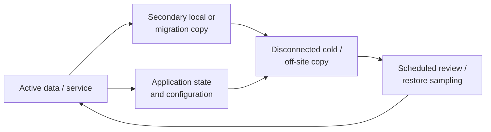

# Backup & Recovery Practices

Recoverability is part of system operation, not a task deferred until failure. Across the Systems Lab, that means separating active data from recovery copies, protecting application state as well as user files, preserving unstable sources before repair, and validating that a backup can produce a usable restore.

## Recovery model

The diagram describes the operating pattern across projects; it does not claim a fully automated enterprise backup platform or universal implementation of every copy for every data set.

## Confirmed practices

| Context | Protection and recovery practice |
| --- | --- |
| Jellyfin media | Robocopy-supported migrations and periodic backup of the active media library |
| Jellyfin application state | Separate database/configuration backup so users, metadata, and service state are not conflated with media files |
| Cold/off-site storage | A 12 TB NAS-class disk used periodically for multiple backup purposes and disconnected between uses |
| Personal workstation | Secondary local working storage plus a separate cold/off-site backup practice for selected project and personal data |
| Storage incidents | Disk imaging or cloning before destructive repair when source condition and data value warrant it |
| Capacity upgrades | Data-preserving migration across 2 TB, 4 TB, and 8 TB media-server stages |
| Recovery cases | Restoration from a preserved image after source reinitialization |

The exact off-site storage location and data inventory are intentionally private.

## Backup design principles

### Identify the recovery object

A usable service may depend on more than its large data files. Jellyfin recovery, for example, includes media plus database/configuration state. A Windows workstation may require user data, project files, application settings, license information, and a reproducible deployment path.

### Separate active failure domains

A second disk inside the same computer improves convenience and can support working copies, but it shares power, malware, theft, user-error, and chassis risks. A disconnected copy and an off-site copy address different failure modes.

### Preserve history where deletion propagation matters

Robocopy supports restartable copies, logging, and mirroring options. Destructive mirror/purge behavior requires care because an accidental source deletion can be repeated at the destination. Backup commands should match the retention objective instead of treating synchronization and backup as synonyms.

### Test restoration

A successful copy log is evidence of a transfer, not proof that the service or file set can be restored. Recovery assurance improves when representative files are opened, application state is restored in a test location, and the result is documented.

## Practical workflow

1. Inventory the data/service and define the recovery objective.
2. Identify active, local-secondary, disconnected, and off-site copies.
3. Select a copy method that preserves required data and metadata without unintended deletion propagation.
4. Log the operation and review errors or skipped data.
5. Validate destination capacity, representative files, and application state.
6. Disconnect and relocate cold media after the operation.
7. Periodically sample a restore and record the outcome.
8. Revisit scope after storage, application, or project-location changes.

## Incident recovery

When the source device itself is unstable, normal backup assumptions no longer apply. The priority becomes minimizing source writes and unnecessary reads, collecting health evidence, and acquiring an image or clone to healthy media. Filesystem repair follows preservation when possible. See [Storage Recovery & Cross-Platform Diagnostics](../projects/storage-recovery/README.md).

## Validation checklist

- Was the intended source copied to the intended destination?
- Did the job log report failed, mismatched, or skipped files?
- Is expected capacity available on the destination?
- Can representative documents, media, archives, and project files be opened?
- Is application state included and version-compatible?
- Can a test restore be performed without overwriting the active system?
- Is the cold copy disconnected after completion?
- Does the off-site copy avoid the same physical incident as the active system?
- Are credentials, encryption recovery material, and product keys protected separately from public documentation?

## High-value improvements

- Establish a written cadence for the media library, Jellyfin state, and critical workstation data.
- Retain Robocopy logs and review nonzero exit codes according to Microsoft's documented bitmask behavior.
- Add checksum or sampled verification where data value justifies the additional time.
- Perform a non-destructive Jellyfin-state restore rehearsal.
- Perform periodic representative file restores from cold/off-site media.
- Label backup disks and jobs clearly enough to prevent source/destination reversal without exposing the off-site location.

## Scope boundaries

These are practical personal and household recovery controls. They are not presented as immutable storage, continuous replication, enterprise disaster recovery, or automated 3-2-1 compliance.

## Selected references

- [Microsoft: Robocopy](https://learn.microsoft.com/en-us/windows-server/administration/windows-commands/robocopy)
- [Jellyfin: Backup and Restore](https://jellyfin.org/docs/general/administration/backup-and-restore/)
- [GNU ddrescue manual](https://www.gnu.org/software/ddrescue/manual/ddrescue_manual.html)
