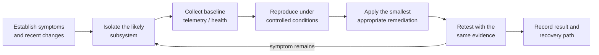

# Technician Bench & Diagnostic Toolkit

The value of a technician bench is not the number of utilities stored on it. It is the ability to choose an appropriate test, understand what the result does and does not prove, remediate the isolated subsystem, and retest under comparable conditions.

No executable or third-party source code is distributed from this repository. Tools are obtained from their official or upstream sources and checked for current applicability before use.

## Troubleshooting loop

## Toolkit by diagnostic purpose

| Purpose | Tools used | What the evidence supports |
| --- | --- | --- |
| Hardware telemetry | HWiNFO64, GPU-Z | Temperatures, clocks, load, power/sensor behavior, device identity, and throttling context |
| CPU load validation | Cinebench | Repeatable CPU load and comparative performance checks when test version/settings are retained |
| GPU load and graphics validation | FurMark, Unigine Superposition | GPU stability, thermal behavior, artifact observation, and comparative results under a defined test |
| Frame-time and latency analysis | CapFrameX, LatencyMon | Frame pacing, stutter investigation, and driver/interrupt latency evidence in context |
| Storage health | CrystalDiskInfo, SMART-capable Linux utilities | Device health attributes, interface information, temperature, and warning indicators |
| Filesystem and volume checks | CHKDSK | Windows volume/filesystem inspection and repair when safe for the target |
| Driver remediation | Display Driver Uninstaller (DDU) | Clean removal of graphics-driver state before controlled reinstall |
| OS integrity | System File Checker (`sfc`) | Windows protected-system-file verification and remediation |
| Memory checks | Windows Memory Diagnostic | Screening for memory errors; escalation to longer tests when symptoms or risk justify it |
| Deployment media | Rufus | Creation of bootable Windows/Linux installation and recovery media from trusted images |
| Administration | PowerShell and Windows administrative tools | Device, service, process, event, network, storage, and operating-system inspection |
| Offline recovery | Bootable Linux recovery environment | OS-independent disk identification, health inspection, imaging, cloning, mounting, and recovery |

## Workflow patterns

### Hardware instability

1. Record the exact symptom, workload, frequency, and recent hardware/firmware/driver changes.
2. Confirm component identity, cabling, power connections, firmware defaults, and visible installation issues.
3. Capture idle telemetry before applying load.
4. Stress one likely subsystem at a time while monitoring temperature, clock, power, errors, and the original symptom.
5. Change one relevant variable, then repeat the same test.
6. Validate normal workload behavior after synthetic testing.

Synthetic load tools can expose instability but do not prove every application is stable. Conversely, a high benchmark score does not prove cooling, frame pacing, storage health, or restart behavior.

### Graphics-driver remediation

DDU is used when changing GPUs or when normal graphics-driver installation cannot resolve a persistent driver-state problem. The workflow preserves required installers, disconnects automatic driver delivery when appropriate, removes the existing driver in the recommended environment, installs a known driver version, then rechecks display, load, sleep/restart, and target-application behavior.

### Storage triage

Storage work begins with correct device identity and source protection. SMART/health evidence and connection checks precede filesystem repair. When media is unstable or data is irreplaceable, imaging or cloning takes priority over repeatedly running write-capable repair tools against the source. See [Storage Recovery & Cross-Platform Diagnostics](../projects/storage-recovery/README.md).

### Windows integrity

CHKDSK, System File Checker, memory diagnostics, Security scans, task/process review, and event evidence are selected according to symptoms. They are not run as an undifferentiated checklist: each tool changes time, load, or in some cases disk state, so the expected diagnostic value must justify it.

## Evidence standards

- Record tool version, test settings, duration, and relevant environmental context.
- Capture telemetry alongside the workload instead of publishing a score in isolation.
- Preserve before/after evidence when a remediation claim depends on comparison.
- Distinguish a screening test from an exhaustive validation.
- Sanitize usernames, serial numbers, file paths, network identifiers, and client information.
- Attribute third-party utilities and scripts to their maintainers.
- Do not treat a downloaded administration toolkit as authored work.

## Maintenance

- Obtain utilities from official/upstream locations rather than an accumulating executable archive.
- Verify signatures or hashes when the publisher provides them.
- Retire utilities that no longer support the target operating system or hardware.
- Refresh bootable media before a planned deployment or recovery event.
- Keep known-good driver and firmware references for active systems where rollback matters.
- Test the recovery environment before it is needed.

## Selected upstream references

- [HWiNFO](https://www.hwinfo.com/)
- [GPU-Z](https://www.techpowerup.com/gpuz/)
- [CapFrameX](https://www.capframex.com/)
- [LatencyMon](https://www.resplendence.com/latencymon)
- [Display Driver Uninstaller](https://www.wagnardsoft.com/display-driver-uninstaller-DDU-)
- [CrystalDiskInfo](https://crystalmark.info/en/software/crystaldiskinfo/)
- [Rufus](https://rufus.ie/en/)
- [Microsoft CHKDSK documentation](https://learn.microsoft.com/en-us/windows-server/administration/windows-commands/chkdsk)
- [Microsoft System File Checker guidance](https://support.microsoft.com/en-us/topic/using-system-file-checker-in-windows-365e0031-36b1-6031-f804-8fd86e0ef4ca)
