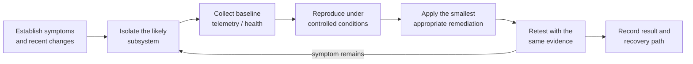

# Technician Bench & Diagnostic Toolkit

The bench is organized around selecting an appropriate test, understanding its limits, isolating the subsystem, applying a focused remediation, and retesting comparably.

No executable or third-party source code is distributed from this repository. Tools are obtained from their official or upstream sources and checked for current applicability before use.

## Troubleshooting loop

## Toolkit by diagnostic purpose

| Purpose | Tools used | What the evidence supports |
| --- | --- | --- |
| Hardware telemetry | HWiNFO64, GPU-Z | Temperatures, clocks, load, power/sensor behavior, identity, and throttling context |
| CPU load validation | Cinebench | Repeatable CPU load and comparative checks with retained test context |
| GPU load and graphics validation | FurMark, Unigine Superposition | Stability, thermal behavior, artifacts, and comparative results under a defined test |
| Frame-time and latency analysis | CapFrameX, LatencyMon | Frame pacing, stutter, and driver/interrupt latency evidence |
| Storage health | CrystalDiskInfo, SMART-capable Linux utilities | Health attributes, interface data, temperature, and warning indicators |
| Filesystem and volume checks | CHKDSK | Windows volume/filesystem inspection and repair when safe for the target |
| Driver remediation | Display Driver Uninstaller (DDU) | Clean removal of graphics-driver state before controlled reinstall |
| OS integrity | System File Checker (`sfc`) | Windows protected-system-file verification and remediation |
| Memory checks | Windows Memory Diagnostic | Error screening with escalation when symptoms justify it |
| Deployment media | Rufus | Creation of bootable Windows/Linux installation and recovery media from trusted images |
| Administration | PowerShell and Windows administrative tools | Device, service, process, event, network, storage, and OS inspection |
| Suspicious behavior triage | Windows Security, Malwarebytes, process/task/startup/file inspection | Layered scanning and manual correlation of unexpected persistence or execution |
| Offline recovery | Bootable Linux recovery environment | Independent disk identification, health inspection, imaging, mounting, and recovery |

## Workflow patterns

### Hardware instability

1. Record the symptom, workload, frequency, and recent changes.
2. Confirm component identity, cabling, power, firmware defaults, and visible installation issues.
3. Capture idle telemetry, then load one likely subsystem while monitoring the original symptom.
4. Change one relevant variable and repeat the same test.
5. Validate normal workload behavior after synthetic testing.

Synthetic load can expose instability but cannot prove application stability, cooling quality, frame pacing, storage health, or restart behavior.

### Graphics-driver remediation

I use DDU for GPU changes or persistent driver-state problems, then install a known driver version and recheck display, load, sleep/restart, and target-application behavior. It is not a routine-update requirement.

### Storage triage

Storage work begins with device identity, source protection, health evidence, and connection checks. Unstable or irreplaceable media is imaged or cloned before write-capable repair. See [Storage Recovery & Cross-Platform Diagnostics](../projects/storage-recovery/README.md).

### Windows integrity and suspicious behavior

CHKDSK, System File Checker, memory diagnostics, and event evidence are selected by symptom. Suspicious behavior triage uses Windows Security scans, Malwarebytes when appropriate, and manual inspection of processes, scheduled tasks, startup entries, and relevant files. This is endpoint triage, not malware-analysis or reverse-engineering specialization.

## Evidence standards

- Record tool version, settings, duration, and relevant context.
- Capture telemetry with the workload instead of publishing a score in isolation.
- Preserve before/after evidence when a remediation claim depends on comparison.
- Distinguish a screening test from an exhaustive validation.
- Sanitize usernames, serials, paths, network identifiers, and client information.
- Attribute third-party tools and never present them as authored work.

## Maintenance

- Obtain tools upstream and verify publisher signatures or hashes when available.
- Retire incompatible utilities and refresh bootable media before planned work.
- Retain known-good driver/firmware references where rollback matters.
- Test recovery media before it is needed.

## Selected upstream references

- [HWiNFO](https://www.hwinfo.com/)
- [GPU-Z](https://www.techpowerup.com/gpuz/)
- [CapFrameX](https://www.capframex.com/)
- [LatencyMon](https://www.resplendence.com/latencymon)
- [Display Driver Uninstaller](https://www.wagnardsoft.com/display-driver-uninstaller-DDU-)
- [CrystalDiskInfo](https://crystalmark.info/en/software/crystaldiskinfo/)
- [Rufus](https://rufus.ie/en/)
- [Microsoft CHKDSK documentation](https://learn.microsoft.com/en-us/windows-server/administration/windows-commands/chkdsk)
- [Microsoft System File Checker guidance](https://support.microsoft.com/en-us/topic/using-system-file-checker-in-windows-365e0031-36b1-6031-f804-8fd86e0ef4ca)
- [Microsoft: Windows Security virus and threat protection](https://support.microsoft.com/en-us/windows/virus-threat-protection-in-windows-security-1362f4cd-d71a-b52a-0b66-c2820032b65e)
- [Malwarebytes](https://www.malwarebytes.com/)
