# Windows Deployment & Provisioning

A repeatable Windows deployment process built around fresh installation media, deliberate setup choices, driver reconciliation, operating-system health checks, and workload-specific validation. The goal is a known, supportable baseline—not an opaque collection of tweaks.

## Deployment lifecycle

```mermaid
flowchart LR
    Requirements["Confirm hardware,<br/>edition, and data plan"] --> Media["Create current<br/>Rufus installation media"]
    Media --> Install["Install Windows<br/>and establish local account"]
    Install --> Drivers["Reconcile firmware,<br/>chipset, device drivers"]
    Drivers --> Provision["Apply reviewed<br/>provisioning choices"]
    Provision --> Health["Validate updates,<br/>devices, OS health"]
    Health --> Workload["Test target workload<br/>and recovery path"]
    Workload --> Baseline["Record sanitized<br/>baseline evidence"]
```

## 1. Requirements and data protection

Before creating media:

- identify the target hardware and required Windows edition;
- confirm whether BitLocker/device encryption or other access controls affect the data plan;
- inventory applications, licenses, browser/profile state, game saves, and user data that require preservation;
- create and verify the required backups;
- obtain current network, chipset, storage, and graphics drivers when offline installation may require them;
- record firmware mode and storage-controller settings that matter to installation.

## 2. Installation media

Rufus is used to create bootable Windows 11 installation media from a trusted image. Rufus supports bootable USB creation from ISO images and provides Windows setup options that can support a local-account-oriented out-of-box experience.

The current preference is fresh, reproducible media rather than carrying a generic cloned Windows image indefinitely between unrelated systems. Historical cloning remains relevant for like-for-like drive migration or preservation, but a fresh install provides a clearer hardware and driver baseline for new builds.

## 3. Installation and account setup

Deployment uses a local-account/OOBE workflow where it suits the system owner and edition. Setup choices are recorded sufficiently to reproduce the baseline without publishing usernames, product keys, answer files, or private account information.

Disk selection receives deliberate attention when multiple drives are installed. Where practical, non-target Windows disks are disconnected during installation to reduce ambiguity about boot files and the destination volume.

## 4. Firmware and driver reconciliation

After first boot:

1. confirm firmware and Windows recognize the expected CPU, memory, storage, network, graphics, and peripheral devices;
2. apply current chipset and platform drivers from the appropriate manufacturer;
3. install graphics drivers appropriate to the workload;
4. resolve unknown devices and verify Device Manager state;
5. apply firmware updates when their documented fix, compatibility, or security value warrants the change;
6. enable supported memory profiles or performance settings after the stock baseline is stable, then validate stability under the target workload.

DDU is reserved for GPU swaps and graphics-driver problems that merit clean removal. It is not required for every routine driver update.

## 5. Provisioning

Unwanted default components and startup behavior are reviewed and reduced where practical for the system's use case. Third-party administration/debloat scripts may assist this work, but they remain upstream software and are not presented as authored here.

Script behavior must be inspected before making claims such as latency optimization, service optimization, privacy hardening, telemetry disablement, or QoS changes. A broad script label does not establish which registry values, packages, services, tasks, policies, or firewall rules it modifies.

Safer provisioning principles include:

- prefer reversible, documented changes;
- create a restore/recovery path before high-impact modifications;
- avoid disabling update, security, networking, or platform services without a tested requirement;
- apply the smallest change set that satisfies the workload;
- rerun device, peripheral, and workload validation after provisioning.

## 6. Health and workload validation

- Complete Windows Update and review failures rather than repeatedly forcing installs.
- Confirm activation without recording product keys.
- Check Device Manager, event evidence relevant to symptoms, storage health, and Windows Security state.
- Use System File Checker, CHKDSK, or memory diagnostics when indicated by deployment results or observed symptoms.
- Validate network, audio, display, sleep, restart, USB, and peripheral behavior.
- Run controlled CPU/GPU/storage tests appropriate to the system.
- Test the actual target workload: household media playback, gaming, development, or simulator integration.
- Record a sanitized baseline of firmware, drivers, memory configuration, thermals, and representative performance.

## Deployment applications

This process supports:

- new custom PC commissioning;
- Windows reinstallation after corruption or storage replacement;
- fresh deployment to the [Personal Performance Workstation](../projects/personal-workstation/README.md);
- planned Windows 11 Pro deployment for the [Racing Simulator PC](../projects/racing-simulator-pc/README.md);
- a potential future Windows 11 Pro upgrade for LAN-restricted Remote Desktop administration of the [Media Server](../projects/self-hosted-media-server/README.md).

Microsoft documents that Windows Professional, Enterprise, Education, and Server editions can host incoming Remote Desktop connections, while Windows Home editions cannot. If the media host is upgraded, Remote Desktop should remain limited to trusted local access rather than exposed directly to the Internet.

## Selected references

- [Rufus: bootable USB creation](https://rufus.ie/en/)
- [Microsoft: Windows 11 download](https://www.microsoft.com/software-download/windows11)
- [Microsoft: System File Checker](https://support.microsoft.com/en-us/topic/using-system-file-checker-in-windows-365e0031-36b1-6031-f804-8fd86e0ef4ca)
- [Microsoft: CHKDSK](https://learn.microsoft.com/en-us/windows-server/administration/windows-commands/chkdsk)
- [Microsoft: Enable Remote Desktop](https://learn.microsoft.com/en-us/windows-server/remote/remote-desktop-services/remotepc/remote-desktop-allow-access)
