# Windows Deployment & Provisioning

A repeatable Windows deployment process built around fresh installation media, deliberate setup choices, driver reconciliation, operating-system health checks, and workload-specific validation. The goal is a known, supportable baseline—not an opaque collection of tweaks.

## Deployment lifecycle

```mermaid
flowchart LR
    Requirements["Confirm hardware,<br/>edition, and data plan"] --> Media["Create current<br/>Rufus installation media"]
    Media --> Install["Install Windows<br/>and establish local account"]
    Install --> Drivers["Reconcile firmware,<br/>chipset, device drivers"]
    Drivers --> Provision["Apply reviewed<br/>provisioning choices"]
    Provision --> Health["Validate updates,<br/>devices, OS health"]
    Health --> Workload["Test target workload<br/>and recovery path"]
    Workload --> Baseline["Record sanitized<br/>baseline evidence"]
```

## 1. Requirements and data protection

Before creating media, I confirm:

- target hardware, Windows edition, firmware/storage-controller state, and offline driver needs;
- whether BitLocker/device encryption affects access or migration;
- applications, licenses, profiles, saves, and user data requiring preservation;
- the required backup or recovery path before installation.

## 2. Installation media

Rufus is used to create bootable Windows 11 installation media from a trusted image. Rufus supports bootable USB creation from ISO images and provides Windows setup options that can support a local-account-oriented out-of-box experience.

I prefer fresh, reproducible media for new builds instead of carrying one cloned Windows image across unrelated systems. Cloning remains useful for like-for-like migration or preservation, while a fresh install provides a clearer hardware and driver baseline.

## 3. Installation and account setup

Deployment uses a local-account/OOBE workflow where it suits the system owner and edition. Setup choices are recorded sufficiently to reproduce the baseline without publishing usernames, product keys, answer files, or private account information.

Disk selection receives deliberate attention when multiple drives are installed. Where practical, non-target Windows disks are disconnected during installation to reduce ambiguity about boot files and the destination volume.

## 4. Firmware and driver reconciliation

After first boot, I:

1. confirm that firmware and Windows recognize the expected components;
2. apply manufacturer chipset, platform, and workload-appropriate graphics drivers;
3. resolve unknown devices and verify Device Manager state;
4. apply firmware updates when a documented fix, compatibility, or security benefit warrants them;
5. enable supported memory profiles only after the stock baseline is stable.

DDU is reserved for GPU swaps and graphics-driver problems that merit clean removal. It is not required for every routine driver update.

## 5. Provisioning

Unwanted default components and startup behavior are reviewed and reduced where practical for the system's use case. Third-party administration/debloat scripts may assist this work, but they remain upstream software and are not presented as authored here.

Script behavior must be inspected before making claims such as latency optimization, service optimization, privacy hardening, telemetry disablement, or QoS changes. A broad script label does not establish which registry values, packages, services, tasks, policies, or firewall rules it modifies.

Provisioning favors reversible, documented changes and the smallest change set that satisfies the workload. A recovery path precedes high-impact changes; update, security, networking, and platform services stay enabled unless a tested requirement supports changing them. Functional validation is repeated afterward.

## 6. Health and workload validation

- Complete Windows Update, confirm activation without retaining keys, and review failures.
- Check Device Manager, relevant events, storage health, and Windows Security state.
- Use System File Checker, CHKDSK, or memory diagnostics only when results or symptoms indicate them.
- Validate network, audio, display, sleep/restart, USB, and peripheral behavior.
- Run controlled subsystem tests and the actual target workload.
- Record a sanitized firmware, driver, thermal, and representative-performance baseline.

## Deployment applications

This process supports:

- new custom PC commissioning;
- Windows reinstallation after corruption or storage replacement;
- fresh deployment to the [Personal Performance Workstation](../projects/personal-workstation/README.md);
- planned Windows 11 Pro deployment for the [Racing Simulator PC](../projects/racing-simulator-pc/README.md);
- a potential future Windows 11 Pro upgrade for LAN-restricted Remote Desktop administration of the [Media Server](../projects/self-hosted-media-server/README.md).

Microsoft documents that Windows Professional, Enterprise, Education, and Server editions can host incoming Remote Desktop connections, while Windows Home editions cannot. If the media host is upgraded, Remote Desktop should remain limited to trusted local access rather than exposed directly to the Internet.

## Selected references

- [Rufus: bootable USB creation](https://rufus.ie/en/)
- [Microsoft: Windows 11 download](https://www.microsoft.com/software-download/windows11)
- [Microsoft: System File Checker](https://support.microsoft.com/en-us/topic/using-system-file-checker-in-windows-365e0031-36b1-6031-f804-8fd86e0ef4ca)
- [Microsoft: CHKDSK](https://learn.microsoft.com/en-us/windows-server/administration/windows-commands/chkdsk)
- [Microsoft: Enable Remote Desktop](https://learn.microsoft.com/en-us/windows-server/remote/remote-desktop-services/remotepc/remote-desktop-allow-access)
