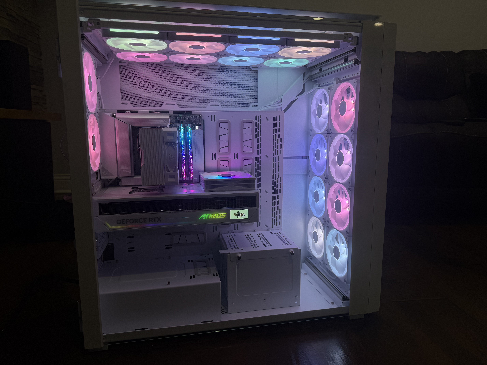
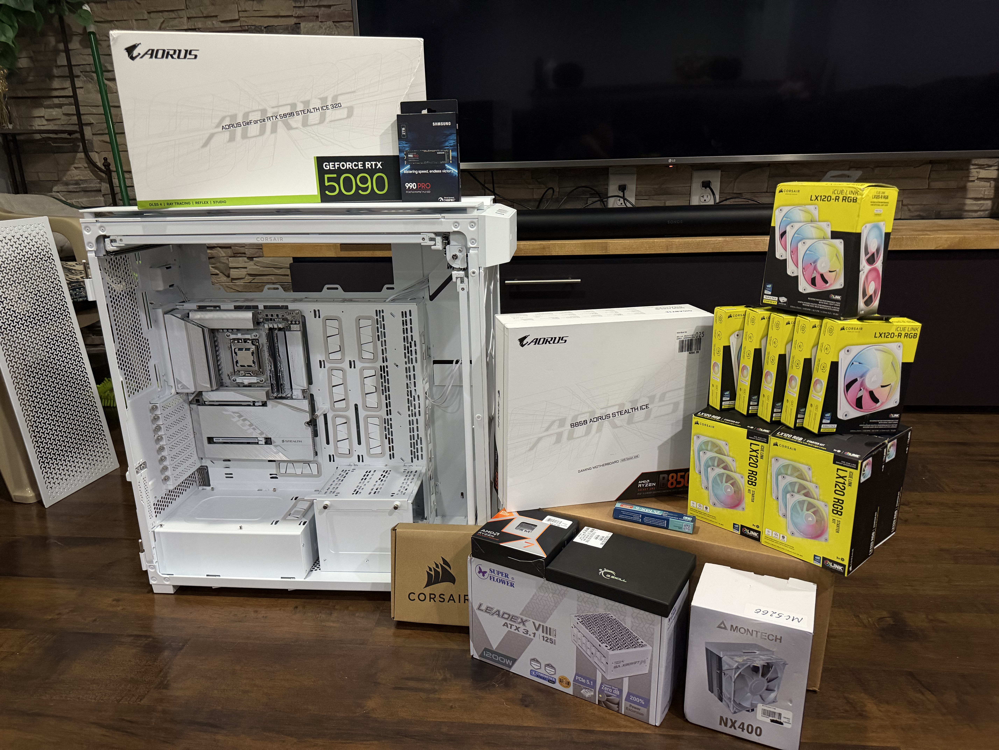
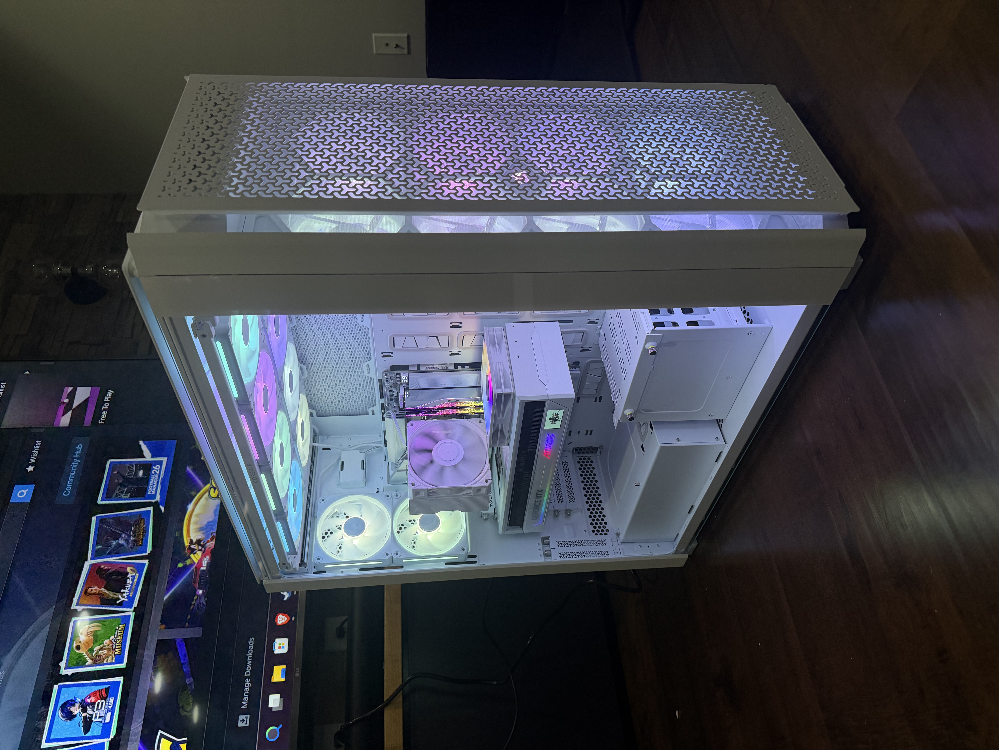

# High-End 4K Racing Simulator System Integration

A flagship client PC built and commissioned for high-end 4K gaming and the first stage of a dedicated racing-simulator environment. The work combined a Ryzen 7 9800X3D and AORUS GeForce RTX 5090 STEALTH ICE 32G with a rear-connector Project STEALTH platform, a fully populated 18-fan CORSAIR iCUE LINK layout, Windows 11 Pro deployment, and systematic post-build validation.

Phase 1 is complete and the system has been handed over operational. Custom water cooling, the complete simulator environment, and the planned multi-display expansion remain separate future work.

*Completed Phase-1 interior: the white 9000D, rear-connector platform, AORUS RTX 5090, temporary air cooler, and full 18-fan installation in operation.*

## Project status

| Stage | Status | Outcome |
| --- | --- | --- |
| Phase 1 — rapid air-cooled commissioning | **Complete** | Physical assembly, firmware and platform configuration, Windows 11 Pro deployment, iCUE LINK integration, validation, and operational client handoff |
| Future phase — custom cooling and simulator expansion | **Planned** | Custom CPU/GPU loop, continued simulator integration, eventual three-display deployment, and validation of the final configuration |

The staged approach gave the client a usable system quickly while separating baseline commissioning from the additional variables introduced by a custom loop. It also validated the expensive core hardware before water-block installation and established a known-good reference point for later modifications.

## Client requirements and constraints

- flagship-class 4K and simulator-oriented gaming performance;
- a coordinated white presentation with minimal visible cabling;
- rapid Phase-1 availability rather than delaying use for custom-loop design;
- extensive controllable fan and lighting integration;
- platform capacity for later custom CPU/GPU cooling;
- a path from one large 4K display to a planned three-display simulator configuration;
- professional firmware, operating-system, driver, and stability commissioning.

The primary build and commissioning work was completed in a one-day session. The client received a functioning Phase-1 system rather than a partially assembled platform awaiting the final cooling phase.

*Phase-1 initial assembly: the Ryzen 7 9800X3D and B850 AORUS STEALTH ICE platform were already installed while the remaining core components were staged for integration.*

## Phase-1 architecture

| Subsystem | Implemented configuration | Engineering role |
| --- | --- | --- |
| CPU | AMD Ryzen 7 9800X3D | Gaming-focused eight-core AM5 platform for the 4K simulator workload |
| Motherboard | GIGABYTE B850 AORUS STEALTH ICE | Project STEALTH rear-connector architecture and AM5 platform integration |
| GPU | AORUS GeForce RTX 5090 STEALTH ICE 32G | Flagship 32 GB white GPU with a hidden power-connector design |
| Memory | G.SKILL Trident Z5 Neo RGB 32 GB (2 × 16 GB), DDR5-6000, CL28-36-36-96, 1.40 V, AMD EXPO, `F5-6000J2836G16GX2-TZ5NRW` | Confirmed low-latency memory configuration with the intended EXPO profile enabled and validated |
| Storage | Samsung 990 PRO 2 TB NVMe SSD | Primary Windows, application, and game storage |
| Power | Super Flower LEADEX VIII Platinum PRO 1200W White | ATX 3.1 / PCIe 5.1 platform with native 12V-2x6 delivery and capacity for later cooling hardware |
| Chassis | CORSAIR 9000D RGB AIRFLOW, white | Super full-tower platform for rear-connector integration, 18-fan deployment, and future custom-loop capacity |
| Phase-1 CPU cooling | MONTECH NX400 White | Intentional temporary air-cooled baseline for rapid commissioning |
| Operating system | Windows 11 Pro | Fresh client deployment and platform baseline |

The installed AORUS GeForce RTX 5090 STEALTH ICE 32G uses a 32 GB GDDR7 Project STEALTH design with its power connector concealed from the traditional visible position. It complements the rear-connector motherboard and compatible 9000D tray as part of one clean, serviceable visible-side architecture.

## Large-format chassis and Project STEALTH integration

The 9000D is a super full-tower, not a routine mid-tower enclosure. Its front and top mounts each accept two rows of four 120 mm fans, its rear accepts two more, and its InfiniRail system supports extensive repositioning and later radiator planning. The chassis also supports GIGABYTE Project STEALTH motherboards with reversed power connections and multiple 480 mm-class radiator positions.

The B850 AORUS STEALTH ICE relocates supported motherboard connectors to the rear face of the board. Pairing that architecture with the chassis kept primary power and front-panel wiring away from the visible motherboard face, reduced visual cable crossings, and produced the clean presentation shown in the completed build. The AORUS GPU's hidden power-connector layout extended the same design principle to the flagship graphics card.

The scale of the chassis created real integration work: physical fan-array planning, controller placement, cable reach and grouping, front-panel adaptation, device enumeration, and preservation of space for the later custom loop. These were chassis-specific design considerations, not simply additional component installation.

*Completed Phase-1 three-quarter view, showing the physical scale of the 9000D and the clean visible-side presentation delivered by the STEALTH architecture.*

## 18-fan iCUE LINK topology

Phase 1 fills the 9000D's documented 18-position capacity for 120 mm fans:

| Location | Population | Physical arrangement | Controller topology |
| --- | --- | --- | --- |
| Front | 8 × CORSAIR iCUE LINK LX120-R RGB | Two rows of four, reverse-rotor front intake | One eight-device channel on Hub 1 |
| Top | 8 × CORSAIR iCUE LINK LX120 RGB | Two rows of four | The second eight-device channel on Hub 1 |
| Rear | 2 × CORSAIR iCUE LINK LX120 RGB | Linked pair | Hub 2 |

Two iCUE LINK System Hubs divide the control and power topology:

- **Hub 1** serves the two large arrays: eight front LX120-R fans on one channel and eight top LX120 fans on the other.
- **Hub 2** serves the two rear LX120 fans and the chassis-lighting connection through the 9000D's **iCUE LINK RGB Adapter**.

Current System Hub firmware supports up to 12 devices per channel. Above the seven-device soft limit, the hub manages its power budget by reducing maximum lighting brightness in steps. The two eight-fan arrays therefore remained within the supported channel capacity while accepting the documented brightness behavior. That tradeoff was reviewed with the client and accepted in exchange for a much simpler controller and cable topology than adding hardware solely to preserve maximum RGB output.

This decision reduced hub count, power/data wiring, USB-header demand, and cross-chassis cable runs while keeping each physical eight-fan bank together as one logical chain. It was a constraint-management choice made around the chassis geometry and the client's priorities.

### Physical-to-logical device mapping

The iCUE setup and device-enumeration workflow required the software order to be reconciled with the actual two-row fan geometry. Each large array was mapped in a snaking physical sequence so lighting progression followed the installed fan positions instead of an arbitrary detection order. The completed mapping aligned controller enumeration, physical location, and lighting behavior across all 18 fans; the client approved the finished result.

### Two distinct 9000D adapters

The case required two separate adapter integrations:

1. The **iCUE LINK RGB Adapter** connects the case-lighting system to iCUE LINK and provides software control for the front-center logo and the lighting around the USB/front-I/O area.
2. The **Front I/O Adapter** converts the case's consolidated FPANEL connection for motherboard layouts that require individual front-panel pins. It added a separate chassis-to-motherboard integration step and was wired correctly on the first attempt.

Together, the two adapters cover iCUE-controlled case/front-I/O lighting and the motherboard's FPANEL connection as distinct parts of the larger chassis integration.

## First-pass assembly quality

Deliberate build sequencing, connector verification, and pre-power inspection paid off when the completed system POSTed cleanly into BIOS on the first press of the power button. No power, front-I/O, connector, or component-detection correction was required.

That first-pass result was especially satisfying in a system combining rear-facing motherboard connectors, a hidden GPU power connection, two LINK hubs, a chassis-specific Front I/O Adapter, separate case-lighting integration, and 18 fans. It reflected the value of methodical routing and connection checks before software commissioning began.

## Firmware, Windows, and platform commissioning

Commissioning established a current, supportable baseline before performance validation:

1. The motherboard was updated from BIOS **F1** to stable **F8** using **GIGABYTE Q-Flash** before broader platform configuration. Firmware was obtained from GIGABYTE's support site and transferred by USB for the update.
2. The installed G.SKILL kit was recognized and its AMD EXPO profile was enabled for the designed DDR5-6000 configuration. Stability was then tested rather than assumed from profile availability.
3. Windows 11 Pro was installed from custom Rufus-created media prepared around the client's requested OOBE and local-account deployment preferences.
4. Windows Update, GIGABYTE platform/device drivers, and the appropriate NVIDIA graphics driver were installed and reconciled. Device detection and platform state were checked after deployment.
5. CORSAIR iCUE was configured for both hubs, the complete fan population, case lighting, and the physical device map.

Manufacturer-supported utilities were used selectively for firmware, platform, storage, and device configuration throughout commissioning.

## Validation and commissioning evidence

Validation covered the system as an integrated platform rather than relying on a single benchmark score:

| Area | Method | Result |
| --- | --- | --- |
| Firmware and hardware detection | BIOS/Q-Flash commissioning and first-boot inventory checks | Platform recognized and commissioned successfully |
| Memory | EXPO verification followed by MemTest86 | DDR5-6000 profile enabled; memory validation passed |
| Storage | Samsung Magician health and diagnostic validation | 990 PRO checks passed |
| CPU | Cinebench R23 | Single-core score of **2,050** with light background activity; accepted as consistent with expected system behavior |
| GPU | Unigine Superposition 1.1, **4K Optimized** | Score of **46,825**; accepted as healthy for the installed RTX 5090 system |
| Thermals | Sensor monitoring during the performed CPU/GPU workloads | Thermal behavior remained within healthy operating ranges |
| Control topology | iCUE enumeration, lighting-order checks, and fan operation | Both hubs, all 18 fans, and case lighting operated as configured |
| Operating system | Update, driver, device, restart, and general stability checks | Windows 11 Pro platform commissioned for handoff |

Representative CPU and GPU runs complemented the broader memory, storage, thermal, driver, operating-system, and control-topology validation completed before handoff.

## Phase-1 result

Phase 1 delivered an operational 9800X3D/RTX 5090 client system with:

- the rear-connector motherboard and hidden GPU-power architecture implemented in the 9000D;
- all 18 planned iCUE LINK fan positions populated and configured across two System Hubs;
- case lighting and front I/O integrated through their separate 9000D adapters;
- first-attempt POST without connector or detection rework;
- BIOS F8, DDR5-6000 EXPO, Windows 11 Pro, current platform drivers, and iCUE commissioned;
- memory, storage, CPU, GPU, thermal, and general system validation completed;
- a functioning system handed over to the client on the rapid Phase-1 schedule.

The temporary MONTECH NX400 is part of that deliberate commissioning architecture. It created a stable, serviceable air-cooled baseline while preserving the client's custom-loop objective for the next phase.

## Future evolution

Only the later-stage work remains open:

- design and install the custom CPU/GPU water-cooling loop;
- complete the cable-management changes associated with reopening the system for that loop;
- continue integration of the racing cockpit, controls, mounts, and other simulator hardware after those components are confirmed;
- expand from the initial Samsung Odyssey Ark 55-inch 2nd Gen display plan toward the intended three-display configuration;
- validate actual multi-display frame-time, thermal, and workload behavior after installation;
- capture final water-cooled build and complete simulator-environment photography.

The simulator plan includes Samsung Odyssey Ark 55-inch 2nd Gen displays at 3840 × 2160, 165 Hz, and 1000R curvature. The complete cockpit and intended three-display configuration remain future work, followed by multi-display performance commissioning.

<!-- MEDIA TODO: phase2-water-cooled-final — add a sanitized final interior photograph only after the custom CPU/GPU loop is implemented and validated. -->

<!-- MEDIA TODO: simulator-final-wide — add a wide simulator-environment photograph only after the cockpit and installed display configuration are complete. -->

## Selected references

- [AMD Ryzen 7 9800X3D specifications](https://www.amd.com/en/products/processors/desktops/ryzen/9000-series/amd-ryzen-7-9800x3d.html)
- [GIGABYTE B850 AORUS STEALTH ICE](https://www.gigabyte.com/us/Motherboard/B850-AORUS-STEALTH-ICE-rev-10)
- [GIGABYTE B850 AORUS STEALTH ICE support and BIOS history](https://www.gigabyte.com/us/Motherboard/B850-AORUS-STEALTH-ICE-rev-10/support)
- [AORUS GeForce RTX 5090 STEALTH ICE 32G](https://www.gigabyte.com/Graphics-Card/GV-N5090AORUSST-ICE-32GD)
- [GIGABYTE Project STEALTH RTX 5090 launch and connector architecture](https://www.gigabyte.com/us/press/news/2292)
- [G.SKILL Trident Z5 Neo RGB DDR5 product family](https://www.gskill.com/products/7/165/390/Trident-Z5-Neo-RGB-DDR5-AMD-EXPO)
- [Samsung 990 PRO 2 TB](https://www.samsung.com/us/memory-storage/nvme-ssd/990-pro-pcie-4-0-nvme-ssd-1tb-sku-mz-v9p2t0b-am/)
- [Super Flower LEADEX VIII Platinum PRO](https://www.super-flower.com.tw/products-detail/LVIII-P-PRO/)
- [CORSAIR 9000D RGB AIRFLOW — White](https://www.corsair.com/us/en/p/pc-cases/cc-9011274-ww/9000d-rgb-airflow-super-full-tower-pc-case-cc-9011274-ww)
- [CORSAIR 9000D fan and radiator compatibility](https://www.corsair.com/us/en/explorer/diy-builder/cases/9000d-fan-and-radiator-compatibility/)
- [CORSAIR 9000D manual and adapter integration](https://www.corsair.com/lm/en/explorer/diy-builder/cases/corsair-9000d-rgb-airflow/)
- [CORSAIR iCUE LINK System Hub channel and brightness behavior](https://www.corsair.com/us/en/explorer/diy-builder/blogs/addressing-over-current-protection-issues-expanding-the-icue-link-system-hub-to-24-devices/)
- [MONTECH NX400](https://www.montechpc.com/nx400)
- [PassMark MemTest86](https://www.memtest86.com/)
- [Samsung Magician](https://semiconductor.samsung.com/consumer-storage/magician/)
- [Maxon Cinebench](https://www.maxon.net/en/tech-info-cinebench)
- [UNIGINE Superposition](https://benchmark.unigine.com/superposition)
- [Rufus bootable USB documentation](https://rufus.ie/en/)
- [Samsung Odyssey Ark 55-inch 2nd Gen specification sheet](https://image-us.samsung.com/SamsungUS/home/computing/monitors/gaming/ls55cg970nnxgo/SPECSHEET_LS55CG970NNXGO_v2.pdf)
