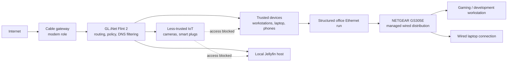

# Segmented Home Network & Security Architecture

A reliability-conscious home network designed to keep trusted computers and household services separated from less-trusted IoT devices. The work combines an OpenWrt-based gateway, managed wired distribution, conservative DNS-layer filtering, and deliberate access boundaries without sacrificing gaming latency or application compatibility.

## Objective

Replace a flat consumer network with an architecture that reduces unnecessary trust between device classes while supporting:

- low-latency gaming and development work;
- dependable wired connectivity in a separate office;
- local access to household services;
- Wi-Fi security cameras, smart plugs, and other IoT devices;
- simple operation without invasive traffic-history retention.

## Environment and requirements

The edge consists of a cable gateway operating in a modem/downstream-router role and a GL.iNet Flint 2 as the primary gateway. One structured Ethernet run reaches the office, where a NETGEAR GS305E five-port smart-managed switch distributes wired connectivity to the main gaming/development workstation and a laptop.

The primary constraint is operational balance: security controls must produce a clear reduction in risk without creating recurring breakage, administrative overhead, or avoidable latency.

## Current architecture

The current design separates trusted computing devices from the IoT side of the network, which also cannot reach the local Jellyfin host. A planned live configuration audit will map the Layer-2/Layer-3 mechanism behind those access boundaries.

The diagram represents current logical reachability. Detailed segmentation, addressing, and firewall mechanisms remain scheduled for the live configuration review.

## Implementation

- Deployed the Flint 2 as the primary routing and policy platform behind the cable gateway.
- Kept normal trusted Wi-Fi clients separate from security cameras, smart plugs, and other less-trusted devices.
- Prevented IoT-side access to trusted computing devices and the local media service.
- Used the GS305E to extend the single office Ethernet run to multiple wired endpoints.
- Configured switch-side traffic priority for the gaming/development workstation when local devices contend; the planned configuration review will document the exact QoS mode and behavior.
- Applied conservative network-wide DNS filtering while avoiding a design centered on detailed browsing-history retention.
- Evaluated and rejected router-wide VPN routing for the current environment because its compatibility and reliability costs did not serve an operational requirement.

## Engineering decisions

### Segmentation is policy, not a résumé keyword

Network separation is valuable when it limits unnecessary communication between devices of different trust levels. The current system enforces restricted IoT reachability; a future configuration audit will map whether the live implementation uses isolated gateway networks, explicit IEEE 802.1Q VLANs, distinct routed interfaces/subnets, or a combination.

### Managed distribution over the existing cable run

The GS305E adds managed fan-out at the office without installing additional in-wall cabling. It supports tagged and untagged 802.1Q membership, port VLAN IDs, port-based priority, and 802.1p/DSCP QoS. A tagged uplink/access-port design remains a future option if the live configuration review shows that it would improve the current policy boundaries.

### Conservative controls preserve compatibility

DNS filtering is maintained as a targeted protective layer. Smart Queue Management is a measurement-driven option rather than a default: it is worth enabling when repeatable loaded-latency tests show bufferbloat, not for configuration complexity alone.

## Security and reliability

- IoT devices cannot freely initiate communication with trusted endpoints.
- Router and switch administration are intended for trusted devices.
- The Jellyfin service remains outside IoT reachability.
- DNS filtering is designed to block known unwanted domains without building a long-term household browsing log.
- Live addressing, SSIDs, device identifiers, credentials, and firewall exports are excluded from this case study.

NIST guidance recommends considering a separate network for smart-home devices; this design applies that principle proportionately to a residential environment.

## Validation

Current validation is operational: trusted wired and wireless clients retain expected connectivity, IoT devices remain usable for their intended functions, the media service remains reachable from approved household clients, and the main workstation receives reliable wired service. A formal configuration review is planned to record the precise segmentation and QoS mechanisms and to test rules from each trust zone.

## Results

The network now provides managed wired office distribution and prevents less-trusted IoT devices from reaching trusted computing endpoints or the local Jellyfin service. The design favors low maintenance and predictable application behavior while preserving a clear path to stronger, explicitly documented policy enforcement.

## Evolution

High-value next steps are to:

1. export a sanitized inventory of the live Flint 2 networks/interfaces and firewall zones;
2. verify the GS305E QoS mode and confirm that it provides the intended behavior;
3. decide whether a dedicated Services zone improves policy clarity for Jellyfin;
4. if justified, carry explicit 802.1Q tags across the office run and assign access ports by device role;
5. minimize DNS-query retention while confirming that required applications continue to work;
6. measure idle and loaded latency before deciding whether SQM should be enabled;
7. validate allowed and denied flows from trusted, service, and IoT test clients if a dedicated Services zone is introduced.

<!-- MEDIA TODO:
Add a sanitized architecture diagram after live configuration verification.
Recommended framing: show trust zones and permitted flow categories without VLAN IDs, IP ranges, SSIDs, MAC addresses, admin URLs, or precise firewall exports.
-->

## Technologies and hardware

- GL.iNet Flint 2 (GL-MT6000)
- NETGEAR GS305E smart-managed Gigabit switch
- Structured Ethernet office run
- Network-wide DNS filtering
- Segmented trusted and IoT device groups

## Selected references

- [NIST: smart-home security and separate-device networks](https://www.nist.gov/blogs/taking-measure/7-tips-keep-your-smart-home-safer-and-more-private-nist-cybersecurity)
- [NIST SP 1800-15: Securing Small-Business and Home IoT Devices](https://www.nccoe.nist.gov/publication/1800-15/)
- [GL.iNet Flint 2 user guide](https://docs.gl-inet.com/router/en/4/user_guide/gl-mt6000/)
- [GL.iNet AdGuard Home documentation](https://docs.gl-inet.com/router/en/4/interface_guide/adguardhome/)
- [GL.iNet SQM documentation](https://docs.gl-inet.com/router/en/4/interface_guide/sqm/)
- [NETGEAR GS305E user manual](https://www.downloads.netgear.com/files/GDC/GS305E/GS305E_UM_EN.pdf)
