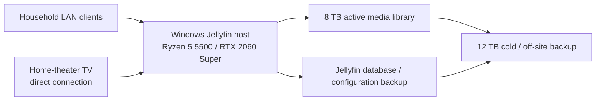

# Self-Hosted Media Server & Home Theater PC

A spare-hardware platform repurposed into a dual-role Windows Jellyfin server and directly connected home-theater PC. The system combines an 8 TB active media library, NVIDIA hardware-accelerated transcoding, LAN-restricted service access, living-room-friendly input, and separate protection for media data and Jellyfin application state.

## Objective

Create a household media platform that could serve local clients while also operating as the primary home-theater computer for Jellyfin, Netflix, YouTube, Hulu, and general playback. The system needed to be straightforward to use from the couch, inexpensive to establish from available parts, secure by default, and recoverable as storage requirements grew.

## Environment and requirements

- local household streaming rather than public Internet service exposure;
- direct connection to the main television;
- enough compute and graphics capacity for on-demand transcoding;
- normal viewing profiles separated from server administration;
- a practical input device for living-room navigation;
- storage migration without rebuilding the media library;
- cold/off-site protection for both media and application state.

## Architecture

The service is intentionally reachable from the household LAN rather than exposed directly to the public Internet.

## Implementation

### Compute platform

The host uses an AMD Ryzen 5 5500, Gigabyte B450M S2H motherboard, NVIDIA RTX 2060 Super, and 32 GB of DDR4. Reusing this hardware provided ample capacity for a native Windows Jellyfin service while retaining a full desktop environment for the directly connected home-theater role.

NVIDIA hardware acceleration is enabled in Jellyfin. The GPU's dedicated video engines handle supported transcode stages, reducing CPU demand when a client cannot direct-play the source format or bitrate.

### Living-room integration

The machine connects directly to the primary television and provides access to household streaming services and local media from one Windows interface. A wireless air-mouse remote supplies motion-based pointer control, click controls, volume/media keys, and a compact rear keyboard, eliminating the need for a conventional desk setup in the living room.

### Accounts and access

Jellyfin administration is separated from everyday playback. The household uses normal viewing profiles while an administrative account is reserved for configuration. The server is kept LAN-restricted, limiting the exposed service boundary to the home network.

### Capacity growth and migration

Active capacity progressed from approximately 2 TB to 4 TB and then to the current 8 TB library. Robocopy supported large copy and migration operations while preserving the collection during drive transitions. Microsoft documents restartable and unbuffered copy modes that are useful for resilient large-file workflows; each migration remains paired with destination verification rather than assuming that command completion proves data integrity.

### Backup and operations

A 12 TB NAS-class drive is periodically used for cold/off-site backup and then disconnected from the active system. It is periodically reconnected and tested, with stored data checked for readability. Jellyfin database/configuration state is backed up separately from the media files and has been successfully restored, demonstrating that library content and users, metadata, and server configuration are distinct recovery tasks.

Maintenance is scheduled outside typical household viewing windows. The system is available for normal media use without requiring permanent public exposure or continuous operation.

## Engineering decisions

### Native Windows fits the combined role

The host is deliberately both a server and an interactive HTPC. A native Windows installation provides direct television use, familiar streaming application access, GPU acceleration, and simple local administration in one environment. Containerization would add an additional operational layer without solving a current requirement; Jellyfin's own documentation directs Windows hosts toward native installation.

### Local exposure minimizes attack surface

Remote Internet streaming is not a requirement, so the service remains local. This avoids public port exposure and keeps access aligned with the intended household use case.

### Reuse before replacement

Repurposing the Ryzen/RTX platform converted available hardware into a capable media system. Capacity was expanded incrementally as the library grew, separating genuine storage demand from unnecessary compute replacement.

### Availability does not replace backup

RAID could improve availability during a disk failure, but it would not replace an independent backup. Because short media-service downtime is acceptable, a single active library disk fits the current availability requirement; the disconnected cold/off-site copy is the more important protection against loss. RAID is not deployed in the documented configuration.

## Reliability and recovery

- active media data and Jellyfin application state have distinct backups;
- Jellyfin database/configuration backups have been restored successfully;
- the cold/off-site disk is disconnected between operations, periodically tested, and checked for data readability;
- Robocopy is used for controlled large-scale copy and migration work;
- viewing accounts do not carry server-administration privileges;
- maintenance is timed around service use;
- local Jellyfin reachability was preserved while AirVPN's Eddie client routed unrelated host traffic.

## Validation

Operational validation includes playback from household clients and the directly connected television, account-role checks, and confirmation that hardware transcoding is enabled. Storage migrations were followed by use of the preserved library on the replacement drive, and Jellyfin database/configuration backups have been restored successfully.

## Results

The result is a practical self-hosted service that consolidates local streaming and home-theater computing, reuses capable hardware, scales storage as the collection grows, and maintains recovery paths for both content and application configuration.

## Evolution

- Formalize media and Jellyfin-state backup cadence, logging, retention, and the existing restore procedure in a repeatable checklist.
- Confirm the installed Windows edition; if remote administration is valuable, evaluate Windows 11 Pro and LAN-restricted Remote Desktop with trusted-user access.
- Keep the service LAN-restricted unless a future requirement justifies a separately secured remote-access design.
- Add checksums or sampled verification to large migration and backup jobs where the added assurance is worth the run time.

<!-- MEDIA TODO:
Add a clean photo showing the host integrated with the home-theater setup.
Recommended framing: include the PC and television context while excluding household identifying details.
-->

<!-- MEDIA TODO:
Add a sanitized Jellyfin playback/transcoding capture.
Recommended framing: show active NVIDIA video decode/encode evidence and a non-identifying test title; remove usernames, library contents, hostnames, and addresses.
-->

## Technologies and hardware

- Windows 11
- Jellyfin
- AMD Ryzen 5 5500
- Gigabyte B450M S2H
- NVIDIA RTX 2060 Super with NVENC/NVDEC acceleration
- 32 GB DDR4
- 8 TB active media storage
- 12 TB NAS-class cold/off-site backup storage
- Robocopy
- AirVPN Eddie client
- Wireless air-mouse/keyboard remote

## Selected references

- [Jellyfin: NVIDIA GPU hardware acceleration](https://jellyfin.org/docs/general/post-install/transcoding/hardware-acceleration/nvidia/)
- [Jellyfin: backup and restore](https://jellyfin.org/docs/general/administration/backup-and-restore/)
- [Jellyfin: container installation guidance](https://jellyfin.org/docs/general/installation/container/)
- [Microsoft: Robocopy](https://learn.microsoft.com/en-us/windows-server/administration/windows-commands/robocopy)
- [Microsoft: Remote Desktop host requirements](https://learn.microsoft.com/en-us/windows-server/remote/remote-desktop-services/remotepc/remote-desktop-allow-access)
