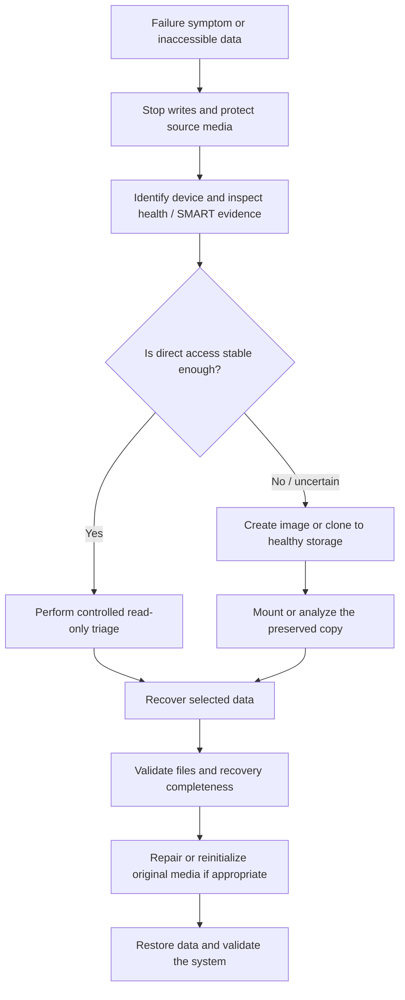

# Storage Recovery & Cross-Platform Diagnostics

A source-preserving recovery practice developed through hands-on Windows and macOS storage incidents. The workflow prioritizes the unstable source, collects health evidence, creates an image or clone when appropriate, recovers from the preserved copy, and postpones destructive repair until the data has a safer path forward.

## Objective

Recover important user data and restore usable systems without allowing an urgent repair attempt to overwrite evidence, accelerate media degradation, or remove the strongest remaining recovery option.

## Recovery workflow

The exact tool depends on the platform, device condition, filesystem, destination capacity, and value of the data. The decision sequence remains consistent.

## Environment and capabilities

- Windows and macOS HDD/SSD failure and data-recovery work;
- bootable Linux media for offline access independent of the installed OS;
- SMART and storage-health inspection;
- mountable disk-image creation and disk cloning;
- recovery from preserved images rather than repeatedly stressing a source;
- Windows CHKDSK, SFC, memory, storage, indexing, and repair workflows;
- driver and operating-system remediation after storage integrity is established.

## Representative recovery work

### Mountable-image recovery on macOS hardware

An unstable drive containing important files showed abnormal behavior. Before reinitializing it, the source was captured into a large mountable disk-image file. The image could be attached as a volume, used as the recovery source, and detached while retaining the preserved file.

After the required data was recovered and checked, the original disk was erased and reinitialized, then the recovered data was restored. The system returned to service through source preservation and logical recovery; mechanical-drive repair and definitive root-cause diagnosis were outside the incident scope.

### Multi-SSD Windows conflict

A Windows system contained two SSDs with Windows installations at the same time and developed a conflicted boot/storage state. The response preserved user data, separated the drives, and repaired filesystem, indexing, and system state as needed.

### Bootable cross-platform recovery environment

Bootable Linux recovery media has been used on both Windows and Mac hardware to work independently of the installed operating system. This enables offline disk identification, health inspection, imaging/cloning, filesystem access, and recovery without immediately booting or writing through a damaged host installation.

## Engineering decisions

### Preserve before repair

Filesystem repair and reinitialization can alter the evidence needed for recovery. When a source is unstable or the data is valuable, imaging or cloning to healthy media establishes a safer working copy before destructive action.

### Diagnose the storage path, not the symptom label

An inaccessible volume may involve media health, cabling, controller behavior, filesystem state, boot configuration, encryption, permissions, or the operating system. Device identity and health evidence come before selecting a repair command.

### Treat the image as a controlled boundary

A mountable image or clone separates acquisition from analysis. Recovery attempts can proceed against the copy while the original is preserved for another pass or specialist escalation.

## Validation

Validation is tied to the objective of each incident:

- confirm the source and destination device identities before acquisition;
- review imaging/copy results and unreadable-region reports where available;
- mount the image or clone without modifying the source;
- open representative recovered files rather than counting filenames alone;
- compare expected folders, file sizes, and timestamps where relevant;
- run filesystem or OS repair against the intended target;
- restart and test the restored system after remediation;
- keep the preserved image until recovery acceptance and backup are complete.

## Results

The approach has supported recovery across Windows and macOS systems, migrations between disks, restoration from mountable images, and remediation of storage-related Windows failures. Its strongest result is procedural: urgent troubleshooting is turned into a controlled sequence that protects future options.

## Tool context

Disk Drill has been used in recovery work alongside operating-system tools and bootable Linux utilities. GNU ddrescue documentation informs the current source-preserving workflow, particularly its approach to copying readable areas first, minimizing repeated reads, and retaining progress in a mapfile.

## Evolution

- Maintain current, tested bootable recovery media with documented checksums and tool sources.
- Standardize an incident worksheet for source/destination identity, health evidence, acquisition method, and validation results.
- Add write-blocking practices where the case value and hardware justify them.
- Define a clear escalation threshold for media with severe physical symptoms or irreplaceable data.
- Preserve recovery logs with identifying information removed when they can support future portfolio evidence.

## Technologies and tools

- Windows and macOS recovery environments
- Bootable Linux recovery media
- SMART / disk-health inspection
- Disk imaging and cloning
- Disk Drill
- CrystalDiskInfo
- CHKDSK
- System File Checker (`sfc`)
- Windows Memory Diagnostic

## Selected references

- [GNU ddrescue manual](https://www.gnu.org/software/ddrescue/manual/ddrescue_manual.html)
- [Microsoft: CHKDSK](https://learn.microsoft.com/en-us/windows-server/administration/windows-commands/chkdsk)
- [Microsoft: System File Checker guidance](https://support.microsoft.com/en-us/topic/using-system-file-checker-in-windows-365e0031-36b1-6031-f804-8fd86e0ef4ca)
